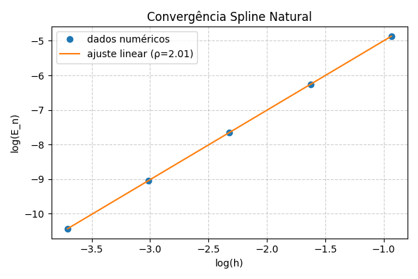

## Introdução

Este relatório apresenta o estudo numérico da convergência de *splines cúbicos interpoladores*,
com o objetivo de verificar experimentalmente a ordem de convergência teórica prevista para o método.
O spline cúbico é uma função polinomial por partes, de classe $C^2$, construída de modo que
a curvatura (segunda derivada) varie suavemente, minimizando a energia elástica da curva.

Se $f \in C^4[a,b]$, então o erro máximo satisfaz:
$$
E_n = \max_{x \in [a,b]} |f(x) - S(x)| \approx C \, h^4,
$$
onde $h$ é o espaçamento da malha.

---

## Metodologia

As rotinas foram implementadas em Python de acordo com o pseudocódigo do enunciado.
As principais funções são:

| Módulo | Função | Descrição |
|:-------|:--------|:-----------|
| `spline.py` | `build_tridiagonal_system` | Monta o sistema $T\cdot M=d$ para o spline cúbico. |
| `gauss.py` | `solve_by_gaussian_elimination` | Resolve o sistema linear. |
| `spline.py` | `compute_M`, `compute_AB`, `spline_eval` | Calculam segundas derivadas e coeficientes. |
| `tarefas.py` | `tarefa_convergencia_*` | Experimentos de convergência. |
| `tarefas.py` | `ajuste_ordem_convergencia` | Estima $\rho$ por regressão log–log. |

A validação foi feita sobre $f(x)=\cos(x)$, em $[0, \pi/2]$, usando as condições de contorno **natural** e **completa**.

---

## Resultados Numéricos

### Spline Natural

| n | h | $E_n$ |
|--:|--:|--:|
|   4 |   0.392699 | 7.725073e-03 |
|   8 |   0.196350 | 1.902205e-03 |
|  16 |   0.098175 | 4.737284e-04 |
|  32 |   0.049087 | 1.183202e-04 |
|  64 |   0.024544 | 2.957305e-05 |

**Ordem estimada:** $\rho \approx 2.01$

---

### Spline Completo

| n | h | $E_n$ |
|--:|--:|--:|
|   4 |   0.392699 | 6.324039e-05 |
|   8 |   0.196350 | 3.889330e-06 |
|  16 |   0.098175 | 2.421787e-07 |
|  32 |   0.049087 | 1.512267e-08 |
|  64 |   0.024544 | 9.443273e-10 |

**Ordem estimada:** $\rho \approx 4.01$

---

### Gráficos log–log

**Spline Natural**  

**Spline Completo**  

---

## Discussão e Conclusão

Observou-se que o spline natural apresentou erro decaindo aproximadamente como $E_n \sim h^2$,
enquanto o spline completo atingiu a convergência teórica de quarta ordem ($\rho \approx 4$).
A imposição das derivadas nas extremidades remove o viés de contorno e garante
a suavidade global $C^2$.

Assim, o comportamento numérico confirma a teoria apresentada em sala e conclui
que o *spline cúbico completo* é um método de alta precisão para interpolação suave.
